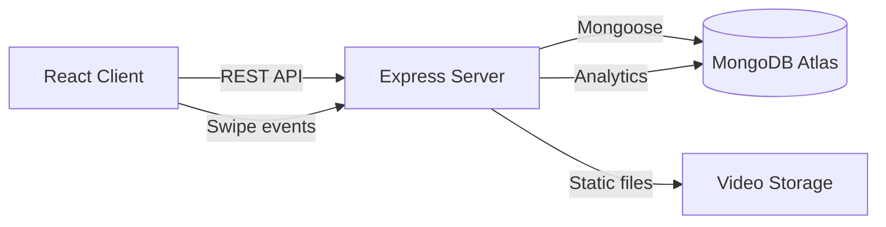

# AI or Ain't

[](https://github.com/salim-lakhal/ai-or-ain-t/actions/workflows/ci.yml)


A mobile-first swipe game that tests your ability to distinguish real videos from AI-generated deepfakes. Swipe right if you think it's real, left if you think it's AI. Every swipe feeds a crowd-sourced dataset for deepfake detection research.

## Demo

<!-- GIF will be added after recording -->

## Architecture



## Tech Stack

| Layer | Technology |
|-------|-----------|
| Frontend | React 19, Framer Motion, Tailwind CSS 4, Vite 6 |
| Backend | Express 4, Mongoose, Helmet, rate-limiting |
| Database | MongoDB Atlas |
| Language | TypeScript (strict mode) |
| Testing | Vitest, Testing Library, Supertest |
| CI/CD | GitHub Actions |

## Features

- Swipe-based video classification with gesture and button controls
- Real-time feedback with explanations for each video
- Score tracking with accuracy percentage and streak counter
- Onboarding flow for new users
- Rate limiting and input validation on all API endpoints
- Helmet security headers, CORS protection, NoSQL injection prevention
- Kaggle dataset integration for bulk video import
- Mobile-responsive design with touch gesture support

## Setup

### Prerequisites

- Node.js 20+
- MongoDB Atlas cluster (or local MongoDB)

### Installation

```bash
git clone https://github.com/salim-lakhal/ai-or-ain-t.git
cd ai-or-ain-t
npm install
```

### Environment

Copy `.env.example` to `.env` and fill in your values:

```bash
cp .env.example .env
```

Required variables:

| Variable | Description |
|----------|------------|
| `MONGO_URI` | MongoDB connection string |
| `PORT` | Server port (default: 3001) |
| `NODE_ENV` | `development` or `production` |
| `ALLOWED_ORIGINS` | Comma-separated CORS origins |
| `SEED_SECRET` | Auth secret for `/api/seed` in production |

### Run

```bash
# Start backend
npm run server

# Start frontend (separate terminal)
npm run dev
```

Open `http://localhost:3000` in your browser.

### Scripts

| Command | Description |
|---------|------------|
| `npm run dev` | Start Vite dev server |
| `npm run server` | Start Express backend |
| `npm run build` | Production build |
| `npm run test` | Run test suite |
| `npm run lint` | Run ESLint |
| `npm run typecheck` | TypeScript type checking |
| `npm run format` | Format with Prettier |

## API

| Method | Endpoint | Description |
|--------|----------|------------|
| `GET` | `/api/health` | Health check and DB status |
| `GET` | `/api/videos?limit=10` | Fetch random videos (max 50) |
| `POST` | `/api/swipes` | Record a user swipe |
| `POST` | `/api/seed` | Seed database with initial videos |

## Project Structure

```
ai-or-ain-t/
├── server.ts                    # Express backend
├── server/
│   ├── config/
│   │   └── database.ts          # MongoDB connection and shutdown
│   ├── middleware/
│   │   ├── security.ts          # Rate limiting, security headers
│   │   └── validation.ts        # Input validation for swipes
│   └── __tests__/               # Backend tests
├── App.tsx                      # Root React component
├── components/
│   ├── Header.tsx               # Stats display
│   ├── SwipeDeck.tsx            # Draggable video card
│   ├── FeedbackOverlay.tsx      # Correct/incorrect feedback
│   ├── Onboarding.tsx           # Onboarding flow
│   └── __tests__/               # Component tests
├── services/
│   └── apiService.ts            # API client
├── types.ts                     # Shared TypeScript types
├── scripts/
│   ├── process_kaggle_dataset.py  # Kaggle dataset importer
│   └── seed_db.ts               # Database seeding script
├── flutter_app/                 # Flutter mobile app (WIP)
└── public/videos/               # Local video files
```

## Kaggle Integration

The project supports bulk video import from the [REAL/AI Video Dataset](https://www.kaggle.com/datasets/kanzeus/realai-video-dataset) on Kaggle.

```bash
pip install kagglehub pymongo
export MONGO_URI='your_connection_string'
python scripts/process_kaggle_dataset.py
```

The script downloads the dataset, extracts metadata, and uploads video URLs to MongoDB. Videos are served from disk via the Express static middleware.

## License

MIT
